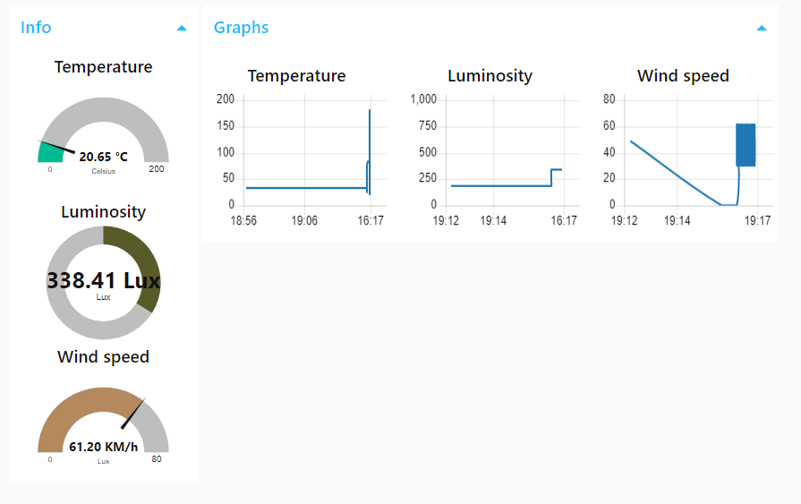

# NAC4 - Estação meteorológica

**nome dos alunos:** 
* Gabriel Henrique Pereira Soares
* Antonio Sassine Mendonça
* Hericlis Ventura de Oliveira

**Turma:** 2TDSF

**Ano:** 2021

## Objetivo / descrição do Projeto

Esse projeto é uma aplicação de estação meteorológica, um Arduino lê informações dos sensores de temperatura humidade e velocidade do vento.
Esses dados são enviados via MQTT para um dashboard, que é atualizado em tempo real com gráficos.
É também enviado via alerta de vento forte (+80km/h) para outros usuários do Twitter via Twitter API.

## Diagrama do projeto
Dashboard

## Como usar 

### 0. Clone esse repositório
* Na linha de comando, vá para uma pasta de preferência onde vai conter os arquivos do projeto
* Insira o comando: git clone https://github.com/ghsoares/NAC4.git e abra a pasta `NAC4`
### 1. Softwares necessários:
* [Simulide](https://www.simulide.com/p/downloads.html)
* [Node-RED (local)](https://nodered.org/docs/getting-started/local)
* Com0Com para simulação da porta serial arduino
### 2. Executando o circuito no Simulide:
* Abra o circuito `circuit.simu`
* Abra o código arduino `circuit.ino`
* Dentro do circuito, clique em um botão chamado "Open" perto do texto "Uart1" para abrir a porta serial
* Inicie a simulação
### 3. Importando os flows no Node-RED:
* Copie o conteúdo do arquivo `flows.json`
* Inicie Node-RED localmente na linha de comando usando o comando `node-red`
* Acesse pelo navegador o endereço http://127.0.0.1:1880/
* No menu import>clipboard cole o conteúdo do arquivo `flows.json` e clique em `import`
* No flow `Twitter bot` configure os dados da API do Twitter com as credenciais da sua conta de desenvolvedor
* Clique em `Deploy` para aplicar as alterações.
* Vá em http://127.0.0.1:1880/ui para visualizar o dashboard

## Link de vídeo demonstração
[Link do video no YouTube](https://youtu.be/BIMZAwNV_VM)

### Referências 
[Projeto original, medidor de temperatura e luminosidade](https://github.com/ghsoares/Global-Solutions---IoT-Arduino)